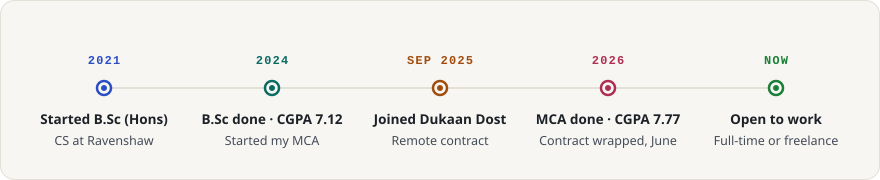
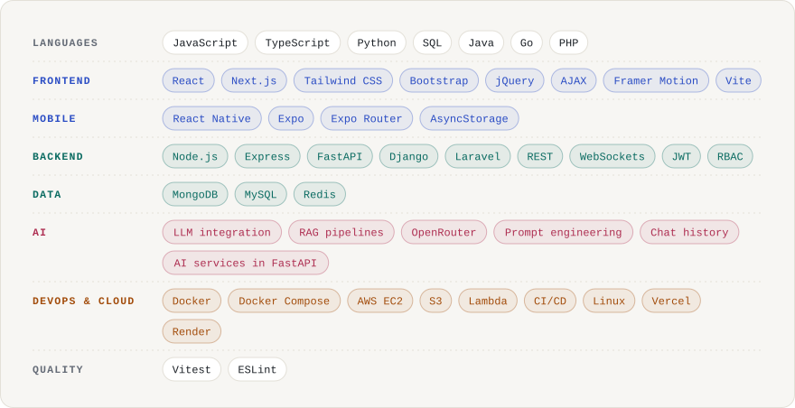

<a href="https://jaypee-2003.github.io/jaypee/"><picture><source media="(prefers-color-scheme: dark)" srcset="assets/header-dark.svg"></picture></a>

  <a href="https://jaypee-2003.github.io/jaypee/"><picture><source media="(prefers-color-scheme: dark)" srcset="assets/link-portfolio-dark.svg"></picture></a>
  <a href="https://www.linkedin.com/in/jayprakash-behera-69a212252/"><picture><source media="(prefers-color-scheme: dark)" srcset="assets/link-linkedin-dark.svg"></picture></a>
  <a href="mailto:jaypeebehera@gmail.com"><picture><source media="(prefers-color-scheme: dark)" srcset="assets/link-email-dark.svg"></picture></a>

I build AI-powered applications, secure multi-role backends and SaaS platforms with React, Node.js, Python, Docker and AWS, and I own both the architecture and the delivery. Most recently I spent ten months at Dukaan Dost on a SaaS platform that serves 1K+ users. I'm looking for a full-time role, and I'm open to freelance and contract projects too.

<picture><source media="(prefers-color-scheme: dark)" srcset="assets/metrics-dark.svg"></picture>

<picture><source media="(prefers-color-scheme: dark)" srcset="assets/section-me-dark.svg"></picture>

<picture><source media="(prefers-color-scheme: dark)" srcset="assets/about-dark.svg"></picture>

<picture><source media="(prefers-color-scheme: dark)" srcset="assets/section-services-dark.svg"></picture>

<picture><source media="(prefers-color-scheme: dark)" srcset="assets/services-dark.svg"></picture>

<picture><source media="(prefers-color-scheme: dark)" srcset="assets/hardening-dark.svg"></picture>

<picture><source media="(prefers-color-scheme: dark)" srcset="assets/section-work-dark.svg"></picture>

<a href="https://edu-examine.vercel.app/"><picture><source media="(prefers-color-scheme: dark)" srcset="assets/card-eduexamine-dark.svg"></picture></a>

<a href="https://edu-examine.vercel.app/"><picture><source media="(prefers-color-scheme: dark)" srcset="assets/link-live-dark.svg"></picture></a>

<a href="https://github.com/Jaypee-2003/SmartFinanceCalc"><picture><source media="(prefers-color-scheme: dark)" srcset="assets/card-smartfinancecalc-dark.svg"></picture></a>

<a href="https://github.com/Jaypee-2003/SmartFinanceCalc"><picture><source media="(prefers-color-scheme: dark)" srcset="assets/link-code-dark.svg"></picture></a>

<a href="https://jp-devanta.vercel.app/"><picture><source media="(prefers-color-scheme: dark)" srcset="assets/card-devanta-dark.svg"></picture></a>

  <a href="https://jp-devanta.vercel.app/"><picture><source media="(prefers-color-scheme: dark)" srcset="assets/link-live-dark.svg"></picture></a>
  <a href="https://github.com/Jaypee-2003/Devanta"><picture><source media="(prefers-color-scheme: dark)" srcset="assets/link-code-dark.svg"></picture></a>

<a href="https://khojpandit.com"><picture><source media="(prefers-color-scheme: dark)" srcset="assets/card-khojpandit-dark.svg"></picture></a>

<a href="https://khojpandit.com"><picture><source media="(prefers-color-scheme: dark)" srcset="assets/link-site-dark.svg"></picture></a>

<picture><source media="(prefers-color-scheme: dark)" srcset="assets/section-experience-dark.svg"></picture>

<picture><source media="(prefers-color-scheme: dark)" srcset="assets/experience-dark.svg"></picture>

<picture><source media="(prefers-color-scheme: dark)" srcset="assets/platform-dark.svg"></picture>

<picture><source media="(prefers-color-scheme: dark)" srcset="assets/section-timeline-dark.svg"></picture>

<picture><source media="(prefers-color-scheme: dark)" srcset="assets/timeline-dark.svg"></picture>

<picture><source media="(prefers-color-scheme: dark)" srcset="assets/section-stack-dark.svg"></picture>

<picture><source media="(prefers-color-scheme: dark)" srcset="assets/stack-dark.svg"></picture>

<picture><source media="(prefers-color-scheme: dark)" srcset="assets/section-activity-dark.svg"></picture>

<picture><source media="(prefers-color-scheme: dark)" srcset="https://raw.githubusercontent.com/Jaypee-2003/Jaypee-2003/output/github-snake-dark.svg"></picture>

<a href="mailto:jaypeebehera@gmail.com"><picture><source media="(prefers-color-scheme: dark)" srcset="assets/footer-dark.svg"></picture></a>
