<!-- ════════════════════════ HERO ════════════════════════ -->
<p align="center">
  <a href="https://jaypee-2003.github.io/jaypee/">
    
  </a>
</p>

<!-- ═════════════════ QUICK NAV (clickable) ═════════════════ -->
<p align="center">
  <a href="#boot"></a>
  <a href="#metrics"></a>
  <a href="#projects"></a>
  <a href="#log"></a>
  <a href="#blueprint"></a>
  <a href="#stack"></a>
  <a href="#telemetry"></a>
</p>

<p align="center">
  <a href="https://jaypee-2003.github.io/jaypee/"></a>
  <a href="https://www.linkedin.com/in/jayprakash-behera-69a212252/"></a>
  <a href="mailto:jaypeebehera@gmail.com"></a>
  
</p>

<!-- ════════════════════════ 01 BOOT ════════════════════════ -->
<a name="boot"></a>

<p align="center">
  
</p>

<details>
<summary><b>▸ <code>cat about.ts</code></b> — expand for the full profile</summary>
<br/>

```ts
const jayprakash = {
  role:         "Full Stack Developer",
  location:     "Odisha, India · open to relocation",
  education:    "MCA, Ravenshaw University (2026)",
  experience:   "Full Stack Developer (Contract) @ Dukaan Dost – Arkine Technologies",
  currentFocus: ["Scalable Node.js APIs", "LLM integration", "React Native apps"],
  stack: {
    frontend: ["React", "Next.js", "React Native (Expo)", "Tailwind CSS"],
    backend:  ["Node.js", "Express", "FastAPI", "REST", "WebSockets"],
    data:     ["MongoDB", "MySQL", "Redis"],
    devops:   ["Docker", "AWS (EC2, S3)", "CI/CD", "Linux"],
  },
  status: "🟢 Open to full-time Full Stack / Backend roles",
};
```

</details>

<!-- ════════════════════════ 02 METRICS ════════════════════════ -->
<a name="metrics"></a>


<p align="center">
  
</p>

<!-- ════════════════════════ 03 PROJECTS ════════════════════════ -->
<a name="projects"></a>

<a href="https://edu-examine.vercel.app/">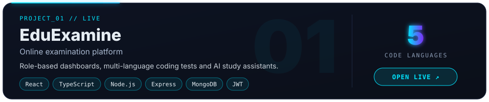</a>

<details>
<summary><b>▸ Under the hood: EduExamine</b></summary>
<br/>

- Role-based dashboards for **Student, Faculty and Admin**, covering the full exam lifecycle from creation to analytics
- Coding assessment module that runs **C, C++, Java, Python and JavaScript**
- Exam integrity: **tab-switch detection, fullscreen enforcement and activity logging**
- **JWT + RBAC** secured APIs, designed for concurrent users during live exams
- AI study assistants via the **OpenRouter API**, with prompt and chat-history management

</details>

<a href="https://github.com/Jaypee-2003/SmartFinanceCalc">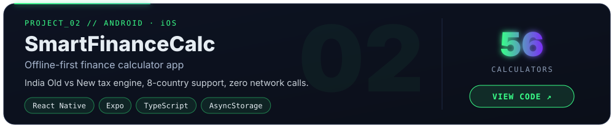</a>

<details>
<summary><b>▸ Under the hood: SmartFinanceCalc</b></summary>
<br/>

- **56 calculators** across Banking, Investment, Finance and General, all computing live as you type
- India income-tax engine: **Old vs New regime**, Sec 87A rebate with marginal relief, surcharge and cess
- **8-country support**: locale auto-detection (no permissions) adapts currency, tax rules and presets
- Pure, UI-free calculation modules; tax slabs live in **versioned JSON**, so yearly law changes need no code changes
- **Zero network calls**: history and data stay on-device with AsyncStorage

</details>

<a href="https://jp-devanta.vercel.app/">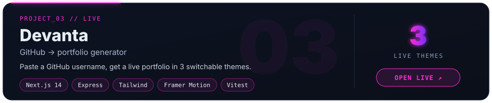</a>

<details>
<summary><b>▸ Under the hood: Devanta</b></summary>
<br/>

- Accepts a **GitHub profile URL, repo URL or username** and builds a portfolio from public data, with no signup
- **3 switchable themes** (Minimal, Modern, Creative) driven by one typed `PortfolioData` JSON shape
- **Express API** fetches the user and repos, ranks featured repos by stars and recency, and handles 400/403/404 cleanly
- Next.js 14 + Framer Motion front end on **Vercel**; API on **Render**; release gate = lint + **Vitest** + build
- [Source code →](https://github.com/Jaypee-2003/Devanta)

</details>

<!-- ════════════════════════ 04 MISSION LOG ════════════════════════ -->
<a name="log"></a>


| ⏱ Timeline | 🛰 Mission | 📈 Outcome |
|:--|:--|:--|
| `2025.09 → 2026.06` | **Full Stack Developer (Contract)**<br/>Dukaan Dost – Arkine Technologies · Remote | SaaS platform (inventory, orders, vendors, tasks) serving **1K+ users**; APIs **30–40% faster** with Redis |
| `2024 → 2026` | **Master of Computer Applications**<br/>Ravenshaw University, Cuttack | CGPA 7.77 |
| `2021 → 2024` | **B.Sc (Hons) Computer Science**<br/>Ravenshaw University, Cuttack | CGPA 7.12 |

<!-- ════════════════════════ 05 BLUEPRINT ════════════════════════ -->
<a name="blueprint"></a>

> [!TIP]
> The stack I ship with. Use the zoom and pan controls on the diagram to explore it.

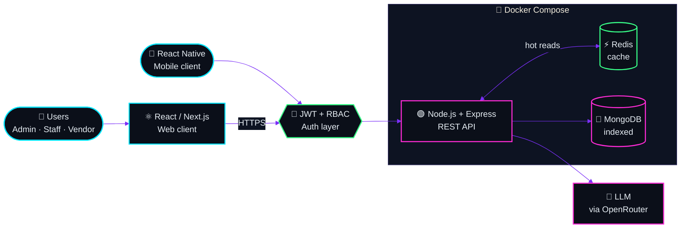

<!-- ════════════════════════ 06 STACK ════════════════════════ -->
<a name="stack"></a>

<p align="center">
  
</p>

<details>
<summary><b>▸ Full loadout by category</b></summary>
<br/>

| Layer | Tools |
|:--|:--|
| **Languages** | JavaScript (ES6+) · TypeScript · Python · SQL · *familiar:* Java, Go, PHP |
| **Frontend** | React.js · Next.js · React Native (Expo) · Tailwind CSS · Framer Motion · Bootstrap |
| **Backend** | Node.js · Express.js · FastAPI · Django · REST APIs · WebSockets · JWT · RBAC |
| **Data** | MongoDB (aggregation, indexing) · MySQL · Redis (caching) |
| **DevOps** | Docker · Docker Compose · AWS (EC2, S3, Lambda) · CI/CD · Vercel · Render · Linux |
| **AI** | LLM integration · OpenRouter API · prompt engineering |
| **Quality** | Vitest · ESLint · Postman |

</details>

<!-- ════════════════════════ 07 TELEMETRY ════════════════════════ -->
<a name="telemetry"></a>

<p align="center">
  
  
</p>

<p align="center">
  
</p>

<p align="center">
  
</p>

<!-- Snake appears after the "Generate snake" GitHub Action runs once -->
<p align="center">
  <picture>
    <source media="(prefers-color-scheme: dark)" srcset="https://raw.githubusercontent.com/Jaypee-2003/Jaypee-2003/output/github-snake-dark.svg"/>
    
  </picture>
</p>

<!-- ════════════════════════ FOOTER ════════════════════════ -->
<p align="center">
  <a href="mailto:jaypeebehera@gmail.com">
    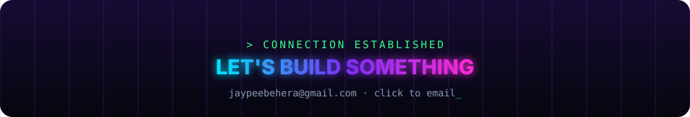
  </a>
</p>

<p align="center"><a href="#boot">▲ back to top</a></p>
